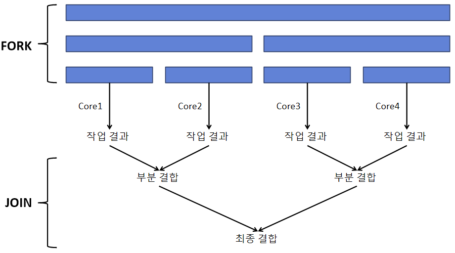

# 스트림과 병렬 처리
* 병렬 처리(Parallel Operation)란 멀티 코어 CPU 환경에서 하나의 작업을 분할해서 각각의 코어가 병렬적으로 처리하는 것
* JAVA 8부터 병렬 스트림을 제공

## 동시성(Concurrency)과 병렬성(Parallelism)
* 동시성: 멀티 작업을 위해 멀티 스레드가 번갈아가며 실행하는 성질
* 병렬성: 멀티 작업을 위해 멀티 코어를 이용해서 동시에 실행하는 성질
* 싱글 코어의 멀티 작업은 동시성 작업
  * 번갈아가며 실행하는 속도가 빨라 병렬성처럼 보이는 것
* **데이터 병렬성**: 전체 데이터를 서브 데이터로 나누고, 각 서브 데이터를 병렬 처리하는 것
  * e.g. 자바의 스트림. 멀티 코어 수만큼 서브 요소들로 나눠 분리된 스레드에서 병렬 처리
* **작업 병렬성**: 서로 다른 작업을 병렬 처리하는 것
  * e.g. 웹 서버. 각 브라우저의 요청 내용을 개별 스레드에서 처리

## 포크조인(ForkJoin) 프레임워크
* 병렬 스트림은 포크조인 프레임워크를 사용
  * **Fork**: 전체 데이터를 서브 데이터로 분리
  * 서브 데이터를 멀티 코어에서 병렬로 처리
  * **Join**: 서브 데이터 처리 결과를 결합해 최종 결과 반환

{: w="30%"}
*ForkJoin*

* 실제 Fork 단계에서는 위 예시처럼 단순하게 데이터를 분할하지 않음
* 포크조인 프레임워크는 스레드풀인 **ForkJoinPool**를 제공
  * 각 코어에서 서브 데이터를 처리하는 것은 개별 스레드가 해야 하므로, 스레드 관리가 필요
  * ExecutorService의 구현 객체인 ForkJoinPool을 사용해 작업 스레드를 관리

## 병렬 스트림 생성
* 병렬 처리를 위해 코드에서 포크조인 프레임워크를 직접 사용해도 됨
* 병렬 스트림을 이용할 경우 백그라운드에서 포크조인 프레임워크가 사용돼 쉽게 병렬 처리 가능
* parallelStream()은 컬렉션으로부터 병렬 스트림을 바로 리턴
* parallel()은 순차 처리 스트림을 병렬 처리 스트림으로 변환해서 처리

```java
MaleMember maleMember = totalList.parallelStream()
  .filter(m -> m.getSex() == Member.Sex.MALE)
  .collect(MaleMember::new, MaleMember::accumlate, MaleMemer::combine);
```

* 쿼드 코어 CPU 기준, 전체 요소가 4개의 서브 요소로 나눠지고 4개의 스레드가 병렬 처리
  * 각 스레드는 서브 요소 수집을 위해 MaleMember::new를 각각 실행함
* 각 스레드는 MaleMember 객체에 남성 요소를 수집하기 위해 MaleMember::accumlate를 매번 실행함
* 수집이 완료된 4개의 MaleMember는 3번의 결합으로 최종 MaleMember가 될 수 있음
  * MaleMember::combine이 총 3번 실행됨

## 병렬 처리 성능
* 병렬 처리가 순차 처리보다 항상 성능이 좋진 않음.
* **요소의 수와 요소당 처리 시간**
  * 컬렉션에 요소 수가 적고 요소당 처리 시간이 짧으면 순차 처리가 더 빠를 수 있음
  * 병렬 처리는 스레드풀 생성, 스레드 생성이라는 오버헤드가 있기 때문
* **스트림 소스 종류**
  * 배열, ArrayList 등 인덱스로 요소를 관리하는 경우 포크 단계에서 요소 분리가 쉬워 병렬 처리 시간이 절약됨
  * HashSet이나 TreeSet처럼 요소 분리가 쉽지 않거나, LinkedList 처럼 링크를 통해 요소들을 연결해놓은 경우 요소 분리가 어려움
    * ArrayList, 배열보다는 병렬 처리가 상대적으로 늦음
* **코어(Core)의 수**
  * 싱글 코어인 경우 순차 처리가 빠름
    * 병렬 스트림을 쓰는 경우 스레드만 증가하고 동시성 작업으로 처리되므로

```java
public class Example {
  public static final int SLEEP_VAL = 100; // 작을수록 순차 처리가 빠름

  public static void work(int value) {
    try {
      Thread.sleep(SLEEP_VAL);
    } catch (InterruptedException e) {
    }
  }

  // 순차 처리
  public static long testSequencial(List<Integer> list) {
    long start = System.nanoTime();
    
    list.stream().forEach((a) -> work(a));

    long end = System.nanoTime();
    return end - start;
  }

  // 병렬 처리
  public static long testParallel(List<Integer> list) {
    long start = System.nanoTime();
    
    list.stream().parallel().forEach((a) -> work(a));

    long end = System.nanoTime();
    return end - start;
  }


  public static void main(String[] args) {
    List<Integer> list = Arrays.asList(0, 1, 2, 3, 4, 5, 6, 7, 8, 9);

    long time1 = testSequencial(list);
    long time2 = testParallel(list);
  }
}
```
```java
public class Example {
  public static final int SLEEP_VAL = 10;

  public static void work(int value) {
  }

  // 병렬 처리
  public static long testParallel(List<Integer> list) {
    long start = System.nanoTime();
    
    list.stream().parallel().forEach((a) -> work(a));

    long end = System.nanoTime();
    return end - start;
  }


  public static void main(String[] args) {
    List<Integer> arrayList = new ArrayList<>();
    List<Integer> linkedList = new LinkedList<>();

    for(int i = 0; i < 1_000_000; ++i) {
      arrayList.add(i);
      linkedList.add(i);
    }

    // warm up
    long time1 = testParallel(arrayList);
    long time2 = testParallel(linkedList);

    time1 = testParallel(arrayList);
    time2 = testParallel(linkedList);
  }
}
```

