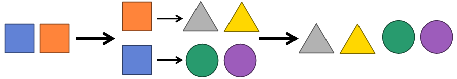
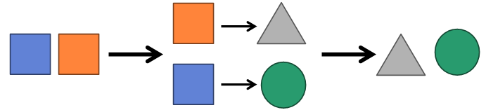

# 스트림과 여러 메소드
## 필터링(distinct(), filter())
* 모든 스트림이 가지는 공통 메소드
* **distinct()**: 중복 제거
  * Stream의 경우 Object.equals()가 true면 동일 객체로 판단
  * IntStream, LongStream, DoubleStream은 동일값일 경우

```java
public class Example {
  public static void main(String[] args) {
    List<String> names = Arrays.asList("John", "Jack", "Dave", "John");

    names.stream()
      .distinct()
      .forEach(System.out::println);

    names.stream()
      .filter(n -> n.startWith("J"))
      .forEach(System.out::println);

    names.stream()
      .distinct()
      .filter(n -> n.startWith("J"))
      .forEach(System.out::println);
  }
}
```

## 매핑(flatMapXXX(), mapXXX(), asXXXStream(), boxed())
### flatMapXXX()
* **요소를 대체하는 복수 개의 요소들**로 구성된 새로운 스트림을 반환

{: w="360" h = "280"}
*flatmap*

```java
public class Example {
  public static void main(String[] args) {
    List<String> inputs1 = Arrays.asList("java8 lambda", "stream mapping");
    inputs1.stream()
      .flatMap(data -> Arrays.stream(data.split(" ")))
      .forEach(System.out::println);

    List<String> inputs2 = Arrays.asList("10, 20, 30, 40, 50, 60");
    inputs2.stream()
      .flatMapToInt(data -> {
        String[] strArr = data.split(",");
        int[] intArr = new int[strArr.length];

        for(int i = 0; i < strArr.length; ++i) {
          intArr[i] = Integer.parseInt(strArr[i].trim());
        }

        return Arrays.stream(intArr);
      })
      .forEach(System.out::println);
  }
}
```

### mapXXX()
* **요소를 대체하는 요소**로 구성된 새로운 스트림 반환

{: w="320" h = "280"}
*map*

```java
public class Example {
  public static void main(String[] args) {
    List<Item> items = Arrays.asList(
      new Item("computer", 1000),
      new Item("car", 5000),
      new Item("cell phone", 500)
    );

    items.stream()
      .mapToInt(Item::getCost)
      .forEach(System.out::println);
  }
}
```

### asDoubleStream(), asLongStream(), boxed()
* asDoubleStream()은 IntStream의 int 요소 또는 LongStream의 long 요소를 double로 타입 변환해 DoubleStream을 생성
  * asLongStream도 마찬가지로 동작
* boxed()는 int, long, double을 Integer, Long, Double로 박싱

```java
public class Example {
  public static void main(String[] args) {
    int[] arry = {1, 2, 3, 4, 5};

    IntStream intStream = Arrays.stream(intArray);
    intStream
      .asDoubleStream()
      .forEach(System.in::println);

    intStream = Arrays.stream(intArray);
    intStream
      .boxed()
      .forEach(i -> System.out.println(i.intValue()));
  }
}
```

## 정렬(sorted())
* 요소가 최종 처리되기 전에 중간 단계에서 요소를 정렬해 최정 처리 순서를 변경
* 객체 요소일 경우 클래스가 Comparable을 구현하지 않으면 sorted()를 호출했을 때 ClassCastException 발생
* 객체를 Comparable 구현 방법에 따라, 원시 타입 요소를 오름차순에 따라 정렬
  * 정렬 방법을 반대로 바꾸고 싶다면 인자로 Comparator.reverseOrder()를 주면 됨
  * 인자로 람다식을 넘겨 정렬 기준을 임의로 정할 수도 있음

```java
public class Item implements Comparable<Item> {
  private String name;
  private int cost;
  ...
  @Override
  public int compareTo(Item i) {
    return Integer.compare(cost, i.cost);
  }
}

public class Example {
  public static void main(String[] args) {
    IntStream intStream = Arrays.stream(new int[] {5, 4, 3, 2, 1});
    intStream
      .sorted()
      .forEach(System.out::println);

    List<Item> items = Arrays.asList(
      new Item("computer", 1000),
      new Item("car", 5000),
      new Item("cell phone", 500)
    );

    items.stream()
      .sorted()
      .forEach(i -> System.out.println(i.getCost()));
    
    items.stream()
      .sorted(Comparator.reverseOrder())
      .forEach(i -> System.out.println(i.getCost()));
  }
}
```

## 루핑(peek(), forEach())
* peek()과 forEach()는 요소 전체를 반복한다는 기능에서는 동일
* peek()은 중간 처리, forEach()는 최종 처리 메소드
* peek()은 중간 처리 단계에서 전체 요소를 루핑하면서 추가 작업을 하기 위해 사용
  * 최종 처리 메소드가 실행되지 않으면 지연되므로 반드시 최종 처리 메소드가 호출돼야 동작
* forEach는 최종 처리 메소드
  * 파이프라인 마지막에 루핑하며 요소를 하나씩 처리
  * 요소를 소비하는 최종 처리 메소드이므로 sum()과 같은 다른 최종 메소드를 이후에 호출 불가

```java
// Not Work
intStream
  .filter(i -> a % 2 == 0)
  .peek(System.in::println);

// Work
intStream
  .filter(i -> a % 2 == 0)
  .peek(System.in::println)
  .sum();

// Error
intStream
  .filter(i -> a % 2 == 0)
  .forEach(System.in::println)
  .sum();
```

```java
public class Example {
  public static void main(String[] args) {
    int[] arr = {1, 2, 3, 4, 5};

    Arrays.Stream(arr)
      .filter(i -> i % 2 == 0)
      .peek(System.out::println); // Not Work

    int total = Arrays.Stream(arr)
      .filter(i -> i % 2 == 0)
      .peek(System.out::println)
      .sum();

    Arrays.Stream(arr)
      .filter(i -> i % 2 == 0)
      .forEach(System.out::println);
  }
}
```

## 매칭(allMatch(), anyMatch(), noneMatch())
* 최종 처리 단계에서 요소들이 특정 조건에 만족하는지 조사
  * allMatch(): **모든 요소들**이 주어진 Predicate의 조건을 **만족**하는지 조사
  * anyMatch(): **최소 한 개의 요소**가 주어진 Predicate의 조건을 **만족**하는지 조사
  * noneMatch(): **모든 요소들**이 주어진 Predicate의 조건을 **만족하지 않는지** 조사

```java
public class Example {
  public static void main(String[] args) {
    int[] arr = {2, 4, 6};

    boolean result = Arrays.stream(arr)
      .allMatch(i -> i % 2 == 0);

    boolean result = Arrays.stream(arr)
      .anyMatch(i -> i % 3 == 0);

    boolean result = Arrays.stream(arr)
      .noneMatch(i -> i % 3 == 0);
  }
}
```

## 기본 집계(sum(), count(), average(), max(), min())
* 집계(Aggregate)는 최정 처리 기능
  * 요소들을 처리해 카운팅, 합계, 평균 등 하나의 값으로 산출하는 것
  * 대량의 데이터를 가공해 축소하는 리덕션(Reduction)의 일종
  
```java
public class Example {
  public static void main(String[] args) {
    long count = Arrays.stream(new int[] {1, 2, 3, ,4 ,5})
      .filter(n -> n % 2 == 0)
      .count();

    long sum = Arrays.stream(new int[] {1, 2, 3, ,4 ,5})
      .filter(n -> n % 2 == 0)
      .sum()
      

    double avg = Arrays.stream(new int[] {1, 2, 3, ,4 ,5})
      .filter(n -> n % 2 == 0)
      .average()
      .getAsDouble();

    int max = Arrays.stream(new int[] {1, 2, 3, ,4 ,5})
      .filter(n -> n % 2 == 0)
      .max()
      .getAsInt();

    int min = Arrays.stream(new int[] {1, 2, 3, ,4 ,5})
      .filter(n -> n % 2 == 0)
      .min()
      .getAsInt();

    int first = Arrays.stream(new int[] {1, 2, 3, ,4 ,5})
      .filter(n -> n % 2 == 0)
      .findFirst()
      .getAsInt();
  }
}
```

### Optional
* 단순 집계 값만 저장하는 것이 아니라, 집계 값이 존재하지 않을 경우 디폴트 값을 설정할 수도 있고, 집계 값을 처리하는 Consumer를 등록할 수 있음

```java
// Error
List<Integer> list = new ArrayList<>();
double avg = list.stream()
  .mapToInt(Integer::intValue)
  .average()
  .getAsDouble();

// Solution 1
Optional optional = list.stream()
  .mapToInt(Integer::intValue)
  .average();

if (optional.isPresent()) {
  System.out.println(optional.getAsDouble());
} else {
  System.out.println(0.0);
}

// Solution 2
double avg = list.stream()
  .mapToInt(Integer::intValue)
  .average()
  .orElse(0.0);
System.out.println(avg);

// Solution 3
list.stream()
  .mapToInt(Integer::intValue)
  .average()
  .ifPresent(System.out::println);
```

## 커스텀 집계(reduce())
* 각 인터페이스에는 매개 타입으로 XXXOperator, 리턴 타입으로 OptionalXXX, int, long, double을 가지는 reduce() 메소드가 오버로딩돼 있음
  * 스트림에 요소가 없을 경우, 디폴트 값인 identity 매개값이 리턴됨
  * XXXOperator 매개값은 집계 처리를 위한 람다식을 대입

```java
public class Example {
  public static void main(String[] args) {
    List<Item> items = Arrays.asList(
      new Item("computer", 1000),
      new Item("car", 5000),
      new Item("cell phone", 500)
    );

    int sum1 = items.stream()
      .mapToInt(Item::getCost)
      .sum();

    // reduce(BinaryOperator<Integer> accumulator)
    int sum2 = items.stream()
      .map(Item::getCost)
      .reduce((a, b) -> a + b)
      .get();

    // reduce(int identity, IntBinaryOperator op)
    int sum3 = items.stream()
      .map(Item::getCost)
      .reduce(0, (a, b) -> a + b);
  }
}
```

## 수집(Collect)
* 필터링 또는 매핑한 후 요소들을 수집하는 최종 처리 메소드

### 필터링한 요소 수집
* `collect(Collector<T, A, R> collector)`는 필터링 또는 매핑된 요소들을 새로운 컬렉션에 수집하고 리턴
  * Collector는 어떤 요소를 어떤 컬렉션에 수집할 것인지 결정
    * T: 요소
    * A: 누적기(accumulator)
    * R: 요소가 저장될 컬렉션
    * A가 ?로 돼 있는 경우는 R이 T를 저장하는 방법을 알고 있어 A를 특정할 필요가 없기 때문

```java
Stream<Member> totalStream = totalList.stream();
Steram<Member> maleStream = totalStream.filter(m -> m.getSex() == Member.Sex.MALE);
Collector<Member, ?, List<Student>> collector = Collectors.toList();
List<Member> maleList = maleStream.collect(collector);

// same
List<Student> maleList = totalList.stream()
  .filter(s -> s.getSex() == Member.Sex.MALE)
  .collect(Collectors.toList());

Stream<Member> totalStream = totalList.stream();
Steram<Member> femaleStream = totalStream.filter(m -> m.getSex() == Member.Sex.FEMALE);
Supplier<HashSet<Member>> supplier = HashSet::new;
Collector<Member, ?, HashSet<Member>> collector = Collectors.toCollection(supplier);
Set<Member> femaleSet = femaleStream.collect(collector);

// same
Set<Member> femaleSet = totalList.stream()
  .filter(s -> s.getSex() == Member.Sex.FEMALE)
  .collect(Collectors.toCollection(HashSet::new));
```

### 사용자 정의 컨테이너에 수집
* 요소들을 필터링, 또는 매핑해 사용자 정의 컨테이너 객체에 수집할 수 있도록 하는 collect 메소드를 추가 제공
  * 파라미터
    * Supplier: 요소들이 수집될 컨테이너 객체 R을 생성
      * 싱글 스레드 스트림에서는 Supplier가 단 한 번 실행돼 하나의 컨테이너 객체 생성
      * 멀티 스레드 스트림에서는 여러 번 Supplier가 실행되고 스레드별로 컨테이너 객체 생성하지만, 최종적으로 하나의 컨테이너 객체로 결합
    * XXXConsumer: R에 요소 T를 수집하는 역할. 요소를 컨테이너에 수집할 때마다 실행
    * BiCousumer: R을 결합하는 역할. 멀티 스레드 스트림에서만 호출

```java
public class MaleMember {
  private List<Member> list;

  public MaleMember() {
    list = new ArrayList<>();
  }

  public void accumulate(Member member) {
    list.add(member);
  }

  public void combine(MaleMember other) {
    list.addAll(other.getList());
  }

  public List<Member> getList() {
    return list;
  }
}

public class Example {
  public static void main(String[] args) {
    List<Member> totalList; // add some elements

    Stream<Member> totalStream = totalList.stream();
    Stream<Member> maleStream = totalStream.filter(m -> m.getSex() == Member.Sex.MALE);
    Supplier<MaleMember> supplier = () -> new MaleMember();
    BiConsumer<MaleMember, Member> accumulator = (mm, m) -> mm.accumulate(m);
    BiConsumer<MaleMember, MaleMember> combiner = (mm1, mm2) -> mm1.combine(mm2);
    MaleMember maleMember = maleStream.collect(supplier, accumulator, combiner);

    // same
    MaleMember maleMember = totalList.stream()
      .filter(m -> m.getSex() == Member.Sex.MALE)
      .collect(
        () -> new MaleMember(),
        (r, t) -> r.accumulate(),
        (r1, r2) -> r1.combine(r2)
      );

    // same
    MaleMember maleMember = totalList.stream()
      .filter(m -> m.getSex() == Member.Sex.MALE)
      .collect(MaleMember::new, MaleMember::accumulate, MaleMember::combine);
  }
}
```

### 요소를 그룹핑해서 수집
* 컬렉션의 요소들을 그룹핑해서 Map 객체 생성 가능
  * collect()를 호출할 때, Collectors의 groupingBy() 또는 groupingByConcurrent()가 리턴하는 Collector를 매개값으로 대입하면 됨

```java
Stream<Member> totalStream = totalList.stream();
Function<Member, Member.Sex> classifier = Member::getSex;
Collector<Member, ?, Map<Member.Sex, List<Member>>> collector = Collectors.groupingBy(classifier);
Map<Member.Sex, List<Member>> mapBySex = totalStream.collect(collector);

// same
Map<Member.Sex, List<Member>> mapBySex = totalList.stream()
  .collect(Collectors.groupingBy(Member::getSex));

Stream<Member> totalStream = totalList.stream();
Funtion<Member, Member.City> classifier = Member::getCity;
Funtion<Member, String> mapper = Member::getName;
Collector<String, ?, List<String>> collector1 = Collectors.toList();
Collector<Member, ?, List<String>> collector2 = Collectors.mapping(mapper, collector1);
Collector<Member, ?, Map<Member.City, List<String>>> collector3 = Collectors.groupingBy(classifier, collector2);
Map<Member.City, List<String>> mapByCity = totalStream.collect(collector3);

// same
Map<Member.City, List<String>> mapByCity = totalList.stream()
  .collect(
    Collectors.groupingBy(
      Member::getCity,
      Collectors.mapping(Member::getName, Collectors.toList())
    )
  );

// treemap
Map<Member.City, List<String>> mapByCity = totalList.stream()
  .collect(
    Collectors.groupingBy(
      Member::getCity,
      TreeMap::new,
      Collectors.mapping(Member::getName, Collectors.toList())
    )
  );
```

### 그룹핑 후 매핑 및 집계
* Collectors.groupingBy()는 그룹핑 후, 매핑이나 집계를 할 수 있도록 두 번째 매개값으로 Collector를 가질 수 있음

```java
Stream<Member> totalStream = totalList.stream();
Funtion<Member, Member.Sex> classifier = Member::getSex;
ToIntFunction<Member> mapper = Member::getAge;
Collector<Member, ?, Integer> collector1 = Collectors.averagingInt(mapper);
Collector<Member, ?, Map<Member.Sex, Integer>> collector2 = Collectors.groupingBy(classifier, collector1);
Map<Member.Sex, Integer> mapBySex = totalStream.collect(collector2);

// same
Map<Member.Sex, Integer> mapBySex = totalList.stream()
  .collect(
    Collectors.groupingBy(
      Member::getSex,
      Collectors.averagingInt(Member::getAge)
    )
  );

Map<Member.Sex, String> mapByName = totalList.stream()
  .collect(
    Collectors.groupingBy(
      Member::getSex,
      Collectors.mapping(
        Member::getName,
        Collectors.joining(",")
      )
    )
  );
```
